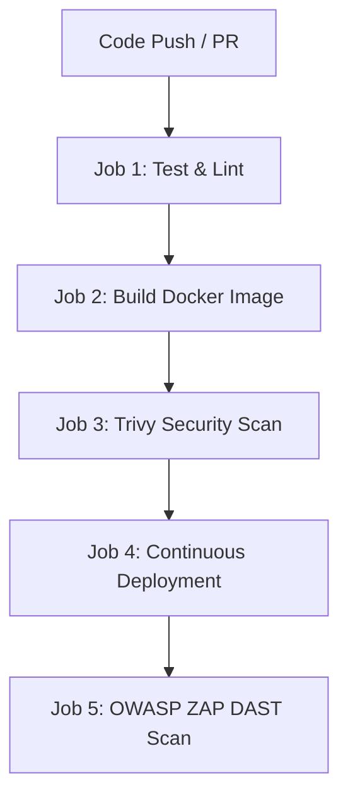

# 🌐 Secure Static Website Deployment via CI/CD Pipeline with GitHub Actions

This project implements an automated **CI/CD pipeline using GitHub Actions** to build, scan, secure, and deploy a containerized static website (HTML/CSS/JavaScript) onto a self-hosted target deployment server.

The pipeline integrates advanced **DevSecOps** practices to catch vulnerabilities and quality issues at every single stage of the software development lifecycle.

---

## 📂 Project Structure


```text
├── .github/
│   └── workflows/
│       └── deployment.yml                 # The GitHub Actions workflow file
├── audio/                           # Folder containing audio assets
├── tardis/                          # Folder containing additional project assets
├── .gitignore                       # Gitignore
├── BD_Cartoon_Shout-webfont.ttf     # Custom font file used by the website

├── Dockerfile                       # Production container setup for the static site
├── index.html                       # Main entry point website file
├── LICENSE                          # Project license file
├── modernizr-1.5.min.js             # JavaScript library for browser compatibility
├── pacman.js                        # Main frontend application logic script
├── README.md                        # Documentation file
└── sonar-project.properties         # Configuration file for SonarQube analysis

```

---

## 🛠️ CI/CD Pipeline Architecture

The GitHub Actions workflow triggers automatically on any **push** or **pull request** targeting the `main` branch. It consists of 5 sequential, interdependent jobs:



### 1. 🧪 Code Testing & Linting (`test`)
*   **Runner Environment**: `self-hosted`
*   **Steps**: 
    *   Validates HTML coding standards and structural rules using `htmlhint`.
    *   Executes native JavaScript syntax checks using `node --check`.
    *   Initiates code health, maintainability, and code smell analysis through **SonarQube**.
    *   *Enforcement*: Employs a mandatory **SonarQube Quality Gate** check that freezes the pipeline upon failure.

### 2. 🏗️ Container Build (`build`)
*   **Runner Environment**: `ubuntu-24.04` (GitHub-managed runner)
*   **Steps**:
    *   Sets up Docker Buildx for modern, high-performance image layer compiling.
    *   Builds a production-ready isolated Docker image tagged as `site_web_image`.
    *   Compresses and exports the built image into a transferable `.tar` file.
    *   Saves the file securely within GitHub's native job artifacts to safely share it across unlinked runners.

### 3. 🛡️ Static Application Security Testing (`check_security`)
*   **Runner Environment**: `ubuntu-24.04`
*   **Steps**:
    *   Performs a localized file system scan using **Trivy (Aqua Security)**.
    *   *Enforcement*: Configured with `exit-code: '1'`, meaning the build will abruptly fail and terminate if any **HIGH** or **CRITICAL** CVE vulnerabilities are caught in the static files.

### 4. 🚀 Continuous Deployment (`deploy`)
*   **Runner Environment**: `self-hosted`
*   **Steps**:
    *   Downloads and extracts the compiled Docker image archive from the workflow storage.
    *   Cleans up existing container instances on the server to prevent port-binding failures.
    *   Launches the container globally on public port **8080** (mapping internally to Nginx port 80).
    *   Automatically parses host network properties to run a validation check through `curl`.

### 5. 🔍 Dynamic Application Security Testing (`owasp_zap_scan`)
*   **Runner Environment**: `self-hosted`
*   **Steps**:
    *   Performs an active, automated black-box penetration assessment using the **OWASP ZAP Baseline Scan** against the deployed live environment (`http://172.20.20.23:8080`).
    *   Breaks the pipeline if high-risk vulnerabilities listed in the OWASP Top 10 are identified.
    *   Compiles a downloadable, comprehensive reporting webpage named `zap-scan-report`.

---

## 🔐 GitHub Secrets Configuration

To authenticate third-party scanners securely, navigate to `Settings > Secrets and variables > Actions` inside your GitHub repository, and configure the following environment secrets:

| Secret Key | Description | Example Value |
| :--- | :--- | :--- |
| `SONAR_TOKEN` | Generated secure authentication token from your SonarQube account settings. | `sqa_abc123xyz...` |
| `SONAR_HOST_URL` | The reachable IP address or web domain serving your private SonarQube instance. | `http://172.20.20.50:9000` |

---

## 🏃 Self-Hosted Runner Requirements

The server machine configured as your GitHub Auto-Heberged (`self-hosted`) runner must come pre-equipped with the following packages:
*   **Docker Engine**: Installed and added to the user group permissions so the `github-runner` agent can trigger containers without needing root elevation.
*   **Node.js**: Version `24` or higher installed globally to run script validation engines swiftly.
*   **Networking Utilities**: Core utilities (`curl`, `awk`, `hostname`) available in the system PATH.
